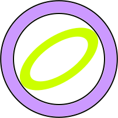

# Ring

Standalone link-battle netplay for **Mega Man Battle Chip Challenge (US)**
and its JP original, **Rockman EXE Battle Chip GP** — including US↔JP
crossplay.

This is a single-purpose GBA frontend: it plays the game normally in a
window, and replaces the link cable with a WebRTC data channel paired
through tango's matchmaking server. There is no lobby, no save editor, no
replays, no patching — and no autopilot. You play the game; when you want to
battle, walk to **PET → Transmit** in-game, just like you would with a real
cable. The connect screen waits until your opponent is standing in theirs.

## Usage

Run `ring`, pick your ROM and save on the setup screen (the save is
created if missing and written through as you save in-game), and press
**Start game**. To battle, just go to PET → Transmit in-game like you
would with a real cable — the moment the game starts connecting, a dialog
pops up over it asking for a link code. Agree on one with your opponent,
type it in, and press **Connect** (or just hit Enter) — the matchmaking
server pairs you and NAT traversal is handled (STUN/TURN), so no port
forwarding. Cancelling the dialog fails the connection attempt, so the
game backs out through its own comm-error screen. When the match ends (or
you otherwise leave Transmit) the connection closes by itself, like
unplugging the cable; the dialog returns next time you transmit. Closing
the window quits (there is no other chrome); paths and settings are saved
on the way out.

The WebRTC offerer is P1 (parent/left); the answerer is P2. Link codes are
namespaced (`ring:<code>`) so they can never collide with Tango lobby
codes on the shared server. ROMs are identified by header game code: US
(`A89E`) or JP (`A89J`), rev 0 — so patched ROMs work as long as the header
is intact (keep both sides' patches identical, or battles may desync; the
link only relays bytes, it can't reconcile diverged battle data). US↔JP
crossplay works, like it would
over a real cable — the JP comm library and battle engine are the US code
shifted, and cross-version battles (both parent directions, plus the guest
exchange) proved frame-exact in the `cross`/`crossr` selftests — a
cross-version link is noted in the log. Per Prof9, EWRAM is identical across
regions, so an EU port only needs a new set of ROM addresses (`hooks.rs`).

Paths, the link code, and the matchmaking endpoint (under **Advanced**)
persist across runs.

## Controls

| GBA | Keyboard | Gamepad |
| --- | --- | --- |
| D-pad | Arrows | D-pad |
| A | Z | South |
| B | X | East |
| L (slot-in) | A | LB |
| R (slot-in) | S | RB |
| Start | Enter | Start |
| Select | Backspace | Back |

## Notes

- All three Transmit modes work: **Normal**, **Random** (the parent's arena
  roll and RNG relay to the child like on a real cable), and **Guest** (the
  non-battle deck exchange — "Guest deck registered!"). Picking different
  modes shows the game's own "Connect failure!".
- "Battle again" within one link session works and keeps the RNG in sync;
  leaving to the PET and re-entering Transmit starts a fresh handshake with
  a fresh seed.
- If the connection drops mid-battle the game aborts through its own
  comm-error screen; press Connect again and re-enter Transmit.
- Verification harnesses (ROMs + saves live untracked in `roms/`:
  `bcc.gba`/`bcc.sav`, `bcgp.gba`/`bcgp.sav`): `cargo run --release
  --example selftest [-- normal|random|guest] [slot] [bcgp|cross|crossr]`
  boots two cores in-process against the real trap set and asserts
  frame-exact sync through a whole battle (`slot` adds asymmetric L/R
  slot-in input; `guest` checks the deck registration, then chains a battle
  over the same link; `bcgp` runs both cores on the JP ROM, `cross`/`crossr`
  mix US and JP with either side as parent); `--example mmtest` pairs two
  clients through the real matchmaking server and pushes bytes through the
  channel; `cargo test` covers the handshake-generation races.

## Building

`cargo build --release`. The emulator and transport crates are git
dependencies on [tangobattle/mgba-rs](https://github.com/tangobattle/mgba-rs),
[tangobattle/tango-rtc](https://github.com/tangobattle/tango-rtc), and
[tangobattle/tango-signaling](https://github.com/tangobattle/tango-signaling),
pinned by `Cargo.lock`; SDL3 builds from source. On Windows you need CMake,
LLVM (`LIBCLANG_PATH`), and an MSVC toolchain.

## How it works

BCC's link versus is turn-based lockstep, not per-frame rollback: the two
consoles exchange decks and an RNG seed once at connect (the drvA–drvD
handshake), then run the same deterministic battle locally, trading an
ordered byte stream through a per-turn SIO barrier (slot-ins ride in it).
`src/hooks.rs` traps the comm library and relays exactly that over a
reliable+ordered data channel (`src/net.rs`), via a shared `Link`
(`src/link.rs`) whose handshake-generation tags keep cancelled connects,
rematches, and reconnects coherent. Emulation is audio-paced
(`src/emu.rs` / `src/audio.rs`, SDL3); the window is iced, same as tango.
Reverse-engineering provenance lives in the doc comments of `hooks.rs`.
